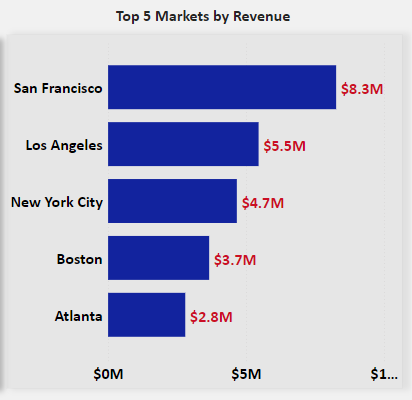

# Meriskill-Sales-Analysis-Report-Excel-Power-Bi  

## Introduction  
In this project, you will dive into a large sales dataset to extract valuable insights.  You will explore sales trends over time, identify the best-selling products, calculate revenue metrics such as total sales and profit margins, and create visualizations to present your findings effectively.  This project showcases your ability to manipulate and derive insights from large datasets, enabling you to make data-driven recommendations for optimizing sales strategies.  

## Purpose  
Analyze sales data to identify trends, top-selling products, and revenue metrics for business decision-making.  

## Problem Statement  
- Sales Trends over time.  
- Identify the best selling products  
- To calculate revenue metrics such as Total sales  
- Profit Margin analysis  

## Mock-Up  
Build a Mock up on dashboard in Power Point and shared as PDF file name 'MOCK_UP_PDF.pdf'  

## Skills/Concepts Demonstrated  
The following Power BI features were incorporated:
- DAX functions  
- Key Measures  
- Tool Tip  
- Last Refresh date  
- Tables Created  

## Following tables are used
•	Sales_Data with columns order_ID, Quantity_ordered, unit price, Order date, Purchase address, Month, Sales, Quantity, Sales, City, Hour, Unit cost (new column for the purpose of Profit margin analysis)  

•	Dim_date table is created as per the below steps:  
            - Power Query Editor -> Right click -> New Query-> Other Sources -> Blank Query.And name it as dim_date.
            - From Google will get the M- formula to create date table:  
               _= {Number.From(#date(2018,1,1))..Number.From(#date(2018,12,31))}_  
               Here , we need to get the first and end date from fact table.In, fact table to get the end date, sort the date column by DESC order.  Use those 2 dates in the above M-formula:  
                _={Number.From(#date(2019,1,1))..Number.From(#date(2020,1,1))}_   
          - Right click->List to Table -> Ok  
          - Rename the column name to date and change the data type to Date.  
          - Fetched the Month_NO,Day name,Year and Month-Name.  
                _Month-Year = FORMAT('dim_date'[date].[Date],"MMM-YY")_    
                
•	Dim_market  
   Segregated the main Sales_Data table and added the City name and its corresponding Region(from ChatGpt) to the table.  
   
•	Dim_Product  
   Segregated the main Sales_Data table and added the Product name and corresponding Product type and Brand names (from ChatGPT).  
   
•	Separate the date and time in Order Date and Time column , in Power query editor using Split column option and delete the extra date column and rename column as Time.  

•	Create a Time_Key column in Table view of Sales_Data table and the formula used is:  
      _Time_Key = Format([Time],"hhmm")_    
  (used to fetch the grain of the data by fetching the hour:minute.)    
  
•	Time table is created for hour extended analysis in Table view  

            _Time =  
            
                  VAR _series = 
                  
                      GENERATESERIES ( 1, 1440, 1 )
                      
                  VAR _time = 
                  
                      ADDCOLUMNS ( _series, "TimeandDay" , TIME ( 0,[Value], 0 ) ) 
                      
                  RETURN
                      ADDCOLUMNS (
                          _time,
                          "Time_Key", FORMAT([TimeandDay], "hhmm"),
                          "Actual Time" , FORMAT ( [TimeandDay], "HH:MM AM/PM" ),
                          "Hour", HOUR ( [TimeandDay] ),
                          "Hour Extended", FORMAT( [TimeandDay], "H AM/PM"),
                          "Minute", MINUTE ( [TimeandDay] ),
                          "AMPM", FORMAT ( [TimeandDay], "AM/PM" )
                      )_  

## Functions/Formula used  

- Created table for the Key measures in Power Bi desktop and measures are as follows:  
      1.	Sales_Qty = SUM(Sales_Data[Quantity Ordered])  
      2.	Revenue = SUM(Sales_Data[Sales_Amount])   
      3.	Total_costs =   
          SUMX(Sales_Data,Sales_Data[Total_Unit_Cost]*Sales_Data[Quantity Ordered])  
      4.	Total_Profit = [Revenue]-[Total_costs]  
      5.	% Profit_Margin = divide([Total_Profit],[Revenue],0)  
      6.	Products = COUNT(dim_product[Product_name])  
      7.	Average = AVERAGE(Sales_Data[Sales_Amount])  
      8.	Monthly Sales Growth =  
          DIVIDE( [Revenue],   
          CALCULATE( [Revenue], DATEADD( dim_date[date], -1, MONTH ) ),0 ) -1   
      9.	Average Sales Per Weekday =   
            VAR  
                WeekdayTable = FILTER(dim_date,dim_date[Day of Week]<>6 && dim_date[Day of Week]<>0)   
                        Return   
                        AVERAGEX(   
                            WeekdayTable,   
                                [Revenue] )   
      10.	Average Sales Per Weekend =   
                VAR  
                    WeekdayTable = FILTER(dim_date,dim_date[Day of Week]<>6 || dim_date[Day of Week]<>0)  
                Return  
                AVERAGEX(  
                    WeekdayTable,  
                        [Revenue] )   
      11.	Average Sales Difference = [Average Sales Per Weekday]-[Average Sales Per Weekend]   

- Last Refresh date table is created:  
        1.	Created a blank query in Power query editor and used the below function in fx:  
              _= DateTime.From(DateTimeZone.SwitchZone(DateTimeZone.FixedLocalNow(),2))_   
        2.	Convert the list to table  
        3.	Rename the table name to ‘Last Refresh’ and rename the column name to ‘Last Refresh Date Time’  
        4.	Duplicate the column and name it as ‘Last Refresh Date’ and update the data type to Date  
        5.	Again, duplicate the column and name it  ‘Last Refresh Time’ and update the data type to Time  
        6.	Create DAX measure as follows under Last Refresh table:   
                  a.	DATE LAST REFRESHED MEASURE:  
                      _Date Last Refreshed = VALUES('Last Refresh'[Last Refresh Date])_    
                  b.	DATE TIME LAST REFRESHED MEASURE:  
                      _DateTime Last Refreshed = VALUES('Last Refresh'[Last Refresh Date Time])_      

## Data Modelling  
The Relationship and the Data model are shown in the below screenshots:  

Relationship                  |     Data-model
:---------------------------: | :-------------------------:
 |  

## Data Source  

In this project, you will explore a substantial sales dataset to uncover valuable insights.  The dataset comprises 185,950 rows and 11 columns.   
Additionally, a new column called "Unit_Cost" was introduced in the Excel sheet using the _=Randombetween()_ function, and the data was subsequently refreshed in Power BI. This newly created column plays a crucial role in calculating the profit margin.  

## Data Transformation/Cleaning 

Connected the excel sheet in Power Bi and transformed the data which took to Power Query Editor  
- Named the first column as ID  
- Renamed the Each price as Unit Price  
- Duplicated ‘Order-Date’ column and updated  data type from Date/Time to Date  
  And then connect with date in dim_date table  
- Created dim_product table with product_name,brand name and product type.Cleaned 3 columns by removing extra space  
- Created dim_market table with Market_name and Region and cleaned 2 columns by removing extra spaces.  

## Visualizations:  

1.	Average Sales on Weekday and Weekends -> Tooltip Average Sales Difference  
2.	Revenue by Hour Extended  
3.	% Profit Margin Analysis  
4.	Top 5 Products by Revenue -> Tooltip Sales Quantity by Product name  
5.	Trends in Product Sales – Monthly Basis  
6.	Top 5 Markets by Revenue -> Tooltip Revenue by Brand name

## Analysis:  

### Average sales on Weekdays and Weekends  

  

In the case of the "Macbook Pro Laptop," it appears that the product performs slightly worse on weekends, with an average sales difference of -145.66.   
This suggests that more units of this product are sold on weekdays compared to weekends.  

iPhones have a significant positive average sales difference on weekends, indicating that they are in high demand during this time.  Continue to promote and feature iPhones prominently during weekends to drive revenue.  

ThinkPad Laptop (Average Sales Difference: 14.04):This product has a positive average sales difference, indicating that it sells better on weekends.  It might be worth focusing on marketing campaigns and promotions during weekends to maximize sales.  

Google Phone (Average Sales Difference: -77.85):Although this product has a negative average sales difference, it's essential to analyze the reasons behind the decline in sales on weekends.  It might require reevaluating the marketing strategy or identifying factors causing this decrease.  

Vareebadd Phone (Average Sales Difference: -33.79):Similar to the Google Phone, this product has a negative average sales difference on weekends.  Investigate the factors contributing to this decline and consider adjustments to improve weekend sales.  

### Revenue by Hour extended  

  

The analysis reveals notable peaks in sales activity during specific time slots, with the highest points occurring at 7 PM and 12 PM, followed by another significant peak at 11 AM and a smaller peak at 8 PM.  

In December 2019, there was a distinct sales peak observed at 11 AM, which was followed by another peak in sales at 7 PM.  This pattern underscores the importance of these time periods in driving sales during that specific month.  

### % Profit margin analysis  

   

Analyzing the increase in the % profit margin from January 2019 to January 2020 (72.5% to 73.9%) is a positive sign for your business.   
The increase in the % profit margin indicates that, on average, your business was more profitable in January 2020 compared to January 2019.  
This is a positive outcome and suggests that you were able to generate a higher percentage of profit relative to your total revenue.   

### Top 5 Products by Revenue  

  

Overall, this analysis highlights the varying performance of different products in terms of revenue and sales quantity. 

The Macbook Pro Laptop stands out for its high revenue, while the iPhone and ThinkPad Laptop show strong sales quantities.  

The Google Phone strikes a balance between revenue and sales quantity, and the 27-inch 4K Monitor demonstrates competitive pricing and demand.  

### Trends in Product Sales - Monthly Basis

  

Dec 2019: Sales growth increased substantially to 44.2%, possibly driven by holiday season demand.  

Jan 2020: Sales growth plummeted to -94.1%, indicating a severe decline in sales, which could be influenced by post-holiday season effects or other market factors.  

In summary, the sales growth trends over this period were quite volatile, with significant fluctuations.  Positive growth periods were interspersed with negative or declining growth.  

Analyzing the reasons behind these trends, such as seasonality, marketing efforts, or economic conditions, can help identify areas for improvement in sales strategies and business planning.  
It's important to maintain a long-term perspective and make data-driven decisions to ensure consistent sales growth.  

### Top 5 Markets by Revenue  

  

San Francisco stands out as having the highest total revenue and the highest Apple revenue, reflecting a strong market for Apple products.  

Los Angeles, NYC, and Boston also have significant Apple revenue, indicating a strong Apple presence in these major cities.  

Atlanta, while having lower total revenue compared to the others, still demonstrates demand for Apple products, with Apple revenue accounting for a substantial portion of the total.  

Overall, the analysis highlights the popularity of Apple products across these cities and their contribution to overall revenue. Understanding regional variations in revenue can inform marketing and sales strategies to maximize revenue potential.  

